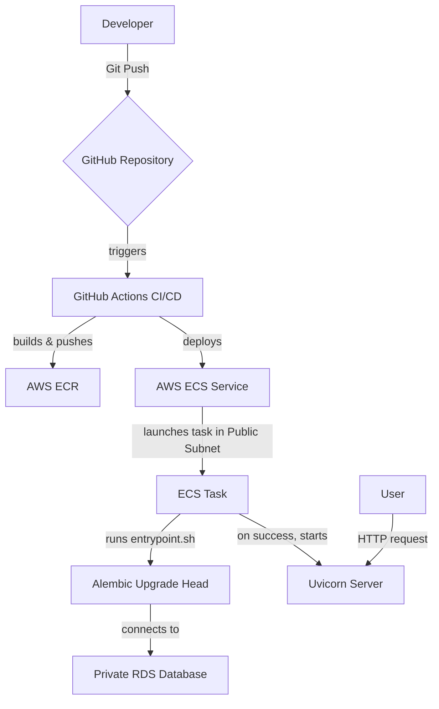

# Alembic Cloud Migrator


A minimal but complete Proof-of-Concept (PoC) demonstrating how to automatically run **Alembic database migrations** at container startup for a **FastAPI** application deployed on **AWS ECS Fargate**.

---

### Project Goal & Description

In modern, containerized deployments, especially in stateless environments like ECS Fargate, managing database schema changes is a critical challenge. The core problem this project solves is: **"How do you ensure your database schema is up-to-date before your application starts handling traffic?"**

This repository provides a reference implementation that solves this by:
1.  Creating a containerized FastAPI application.
2.  Using an `entrypoint.sh` script that first runs `alembic upgrade head` to apply migrations.
3.  After the migration succeeds, the script starts the Uvicorn web server.
4.  Automating the entire infrastructure deployment (VPC, RDS, ECS) using **Terraform**.
5.  Building a complete CI/CD pipeline with **GitHub Actions** to automatically build, push, and deploy the application on every push to the `main` branch.

### Core Technologies

*   **Application:** Python 3.12, FastAPI, SQLAlchemy
*   **Database Migrations:** Alembic
*   **Containerization:** Docker & Docker Compose
*   **Cloud Provider:** Amazon Web Services (AWS)
    *   **Compute:** ECS on Fargate
    *   **Database:** RDS for PostgreSQL
    *   **Networking:** VPC, Subnets, Internet Gateway
    *   **Container Registry:** ECR
    *   **Security:** IAM, Secrets Manager
*   **Infrastructure as Code:** Terraform
*   **CI/CD:** GitHub Actions

### Architecture Diagram



### Project Structure
```
.
├── .github/workflows/      # GitHub Actions CI/CD pipeline
│   └── deploy.yml
├── alembic/                # Alembic migration environment
├── app/                    # FastAPI application source code
├── terraform/              # Terraform files for AWS infrastructure
├── .gitignore
├── Dockerfile              # Defines the application container
├── docker-compose.yml      # For local testing
├── entrypoint.sh           # Startup script for the container
└── requirements.txt        # Python dependencies
```

### How to Run This Project

#### Prerequisites
*   An AWS Account with credentials configured locally.
*   Terraform installed.
*   Docker and Docker Compose installed.
*   AWS CLI installed.

#### 1. Local Testing
This confirms the container logic works before deploying to the cloud.
```bash
# Start the database and the API service
docker compose up --build

# In another terminal, test the API
curl http://localhost:8000/

# Shut down the local services
docker compose down --volumes
```

#### 2. Cloud Deployment

1.  **Initialize and Apply Terraform:**
    Navigate to the `terraform` directory and apply the configuration. This will build all the necessary AWS resources.
    ```bash
    cd terraform
    terraform init
    terraform apply --auto-approve
    ```

2.  **Get the GitHub Actions Role ARN:**
    After the apply is complete, get the ARN for the role that GitHub will use.
    ```bash
    terraform output github_actions_role_arn
    ```

3.  **Configure GitHub Secrets:**
    In your GitHub repository, go to `Settings > Secrets and variables > Actions`. Create the following secrets:
    *   `AWS_REGION`: `ap-southeast-1`
    *   `AWS_IAM_ROLE_ARN`: The ARN you copied from the step above.
    *   `ECR_REPOSITORY_NAME`: `alembic-cloud-migrator`
    *   `ECS_CLUSTER_NAME`: `alembic-cloud-migrator-cluster`
    *   `ECS_SERVICE_NAME`: `alembic-cloud-migrator-service`
    *   `ECS_TASK_DEFINITION_FAMILY`: `alembic-cloud-migrator-task`
    *   `ECS_CONTAINER_NAME`: `alembic-cloud-migrator-container`

4.  **Push to `main`:**
    Commit all your code and push it to the `main` branch. This will trigger the GitHub Actions pipeline to build and deploy your service.

#### 3. Verification
After the pipeline succeeds, a new task will be running in ECS.
1.  Find the public IP of the new running task using the AWS CLI or Console.
2.  Test the endpoints:
    ```bash
    # Test the root endpoint
    curl http://<your-task-public-ip>/

    # Test the database endpoint
    curl http://<your-task-public-ip>/items/
    ```
    **Expected output for `/items/`:**
    ```json
    []
    ```

### Tearing Down
To avoid ongoing AWS costs, destroy all the created infrastructure when you are finished.
```bash
cd terraform
terraform destroy --auto-approve
```
